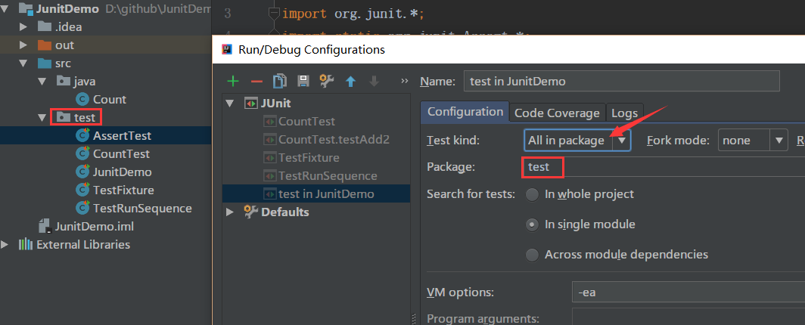

# Junit 编写单元测试

## 注解

| 注解                                 | 含义                                                  |
| ------------------------------------ | ----------------------------------------------------- |
| `@Test`                              | 用来注释一个普通的方法为一条测试用例                  |
| `@Test(expected = XXEception.class)` | 测试抛出指定的异常                                    |
| `@Test(timeout = xxx)`               | 测试运行的时间是否在指定时间以内（*时间单位* 为毫秒） |
| `@Ignore`                            | 忽略的测试用例                                        |
| `@Before`                            | 每一个测试方法之前运行                                |
| `@After`                             | 每一个测试方法之后运行                                |
| `@BeforeClass`                       | 所有测试开始之前运行                                  |
| `@AfterClass`                        | 所有的测试结果之后运行                                |

## 断言方法 API

| 方法                                    | 说明                                                       |
| --------------------------------------- | ---------------------------------------------------------- |
| `assertArrayEquals(expecteds, actuals)` | 查看两个数组是否相等。                                     |
| `assertEquals(expected, actual)`        | 查看两个对象是否相等。类似于字符串比较使用的equals()方法。 |
| `assertNotEquals(first, second)`        | 查看两个对象是否不相等。                                   |
| `assertNull(object)`                    | 查看对象是否为空。                                         |
| `assertNotNull(object)`                 | 查看对象是否不为空。                                       |
| `assertSame(expected, actual)`          | 查看两个对象的引用是否相等。类似于使用“==”比较两个对象。   |
| `assertNotSame(unexpected, actual)`     | 查看两个对象的引用是否不相等。类似于使用“!=”比较两个对象。 |
| `assertTrue(condition)`                 | 查看运行结果是否为true。                                   |
| `assertFalse(condition)`                | 查看运行结果是否为false。                                  |
| `assertThat(actual, matcher)`           | 查看实际值是否满足指定的条件。                             |
| `fail()`                                | 让测试失败。                                               |

## 什么是Fixture

Test Fixture 是指一个测试运行所需的固定环境，准确的定义：

> The test fixture is everything we need to have in place to exercise the SUT

在进行测试时，我们通常需要把环境设置成已知状态（如创建对象、获取资源等）来创建测试，每次测试开始时都处于一个固定的初始状态；测试结果后需要将测试状态还原，所以，测试执行所需要的固定环境称为 Test Fixture。

Junit 的 Fixture 通过使用 `@Before`、`@After`、`@BeforeClass` 、`@AfterClass` 来实现。

## JUnit 用例执行顺序

JUnit 通过 **@FixMethodOrder** 注解来控制测试方法的执行顺序的。

**@FixMethodOrder** 注解的参数是 **org.junit.runners.MethodSorters** 对象,在枚举类 **org.junit.runners.MethodSorters** 中定义了如下三种顺序类型：

- `MethodSorters.JVM`

> Leaves the test methods in the order returned by the JVM. Note that the order from the JVM may vary from run to run (按照JVM得到的方法顺序，也就是代码中定义的方法顺序)

- `MethodSorters.DEFAULT` (默认的顺序)

> Sorts the test methods in a deterministic, but not predictable, order() (以确定但不可预期的顺序执行)

- `MethodSorters.NAME_ASCENDING`

> Sorts the test methods by the method name, in lexicographic order, with Method.toString() used as a tiebreaker (按方法名字母顺序执行)

## JUnit 测试批量运行

### Idea 配置批量运行

#### **设置**

在 IntelliJ IDEA 中，菜单栏：**Run菜单 --> Edit Configurations...选项**。

在 Junit 目录下，选择任意一个用例文件。

- Test Kind : 选择用例的运行类型/级别。
- packages : 选择用例运行的目录，即你的测试用例目录。

设置完成后，点击 **“OK”** 按钮。

#### **运行**

点击 IntelliJ IDEA 工具栏上的运行按钮，来运行 test 目录下的所有用例。

运行结果：

---

### 通过测试套件运行

JUnit 提供了批量运行测试类的方法，称为测试套件。

测试套件写法遵循的原则：

1. 创建一个空类作为测试套件的入口
2. 使用注解 `org.junit.runner.RunWith` 和 `org.junit.runners.Suite.SuitClasses` 修饰空类
3. 将 `org.junit.runners.Suite` 作为参数传入给注解 `RunWith` ，以提示 Junit 为此类测试使用套件运行器执行。
4. 将需要放入此测试套件的测试类组成数组作为注解 `SuiteClasses` 的参数
5. 保证这个空类使用 `public` 修饰，而且存在公开的不带参数的构造函数

