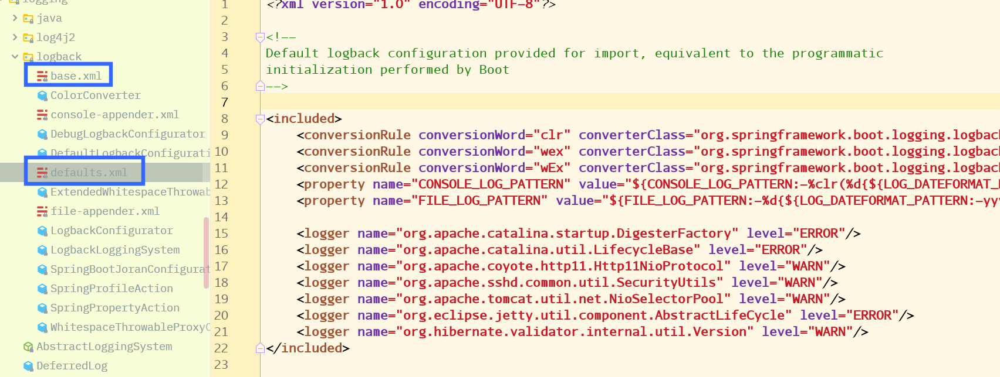

# Spring Boot 与日志

日志框架、日志配置

[TOC]

## 日志框架

日志门面：日志的一个抽象层

市面上的日志框架：JUL、JCL、Jboss-logging、logback、log4j、log4j2、slf4j...****

| 日志门面                                                     | 日志实现                                                     |
| ------------------------------------------------------------ | ------------------------------------------------------------ |
| ~~JCL（久不更新）~~、SLF4j、~~jboss-logging（不适用于普通人群）~~ | Log4j、JUL（Java 自带）、log4j2（框架好但是有些尚未适配）、Logback（与Log4j是同一个作者） |

左边选一个门面（抽象层），右边选一个实现；

**SpringBoot** ：底层为 Spring框架默认选择 JCL、而 SpringBoot 选择 SLF4j、logback


## SLF4j 的使用

### 如何使用

在开发时，不应直接调用日志的实现类，而是应该调用日志的抽象层的方法。

导入 SLF4j 的 jar 和 logback 的 jar

```java
import org.slf4j.Logger;
import org.slf4j.LoggerFactory;

public class HelloWorld {
  public static void main(String[] args) {
    Logger logger = LoggerFactory.getLogger(HelloWorld.class);
    logger.info("Hello World");
  }
}
```

图示：


每一个日志的实现框架都有自己的配置文件，使用 SLF4j后，**配置还是做成日志实现框架的自己的配置文件**。

### 遗留问题

A（SLF4j + logback）：Spring 、Hibernate、MyBatis、..... A 系统的依赖使用了其他的日志框架

统一日志记录，即使是别的框架也统一使用 SLF4j 输出


**如何让系统中所有的日志都统一到slf4j：**

1. 将系统中其他日志框架先排除出去
2. 用中间包来替换原有的日志框架
3. 导入 slf4j 其他的实现


### SpringBoot 与日志的关系

SpringBoot 使用日志功能

```xml
    <dependency>
      <groupId>org.springframework.boot</groupId>
      <artifactId>spring-boot-starter-logging</artifactId>
      <version>2.1.6.RELEASE</version>
      <scope>compile</scope>
    </dependency>
```

底层依赖关系：


总结：

1. SpringBoot 底层也是使用 slf4j + logback 的方式进行日志记录的
2. SpringBoot 把其他的日志都替换为了 slf4j


Maven 排除 jar 包的方法：

```xml
 <dependency>
      <groupId>sample.ProjectB</groupId>
      <artifactId>Project-B</artifactId>
      <version>1.0</version>
      <scope>compile</scope>
      <exclusions>
        <exclusion>  <!-- declare the exclusion here -->
          <groupId>sample.ProjectC</groupId>
          <artifactId>Project-C</artifactId>
        </exclusion>
        <!-- ... -->
      </exclusions> 
 </dependency>
```

也可以在 idea 的 maven 依赖树里面选中不需要的依赖，右键选择 删除

## 日志使用

[LogBack入门实践](https://segmentfault.com/a/1190000004693427)

```java
	// 记录器
    private Logger logger = LoggerFactory.getLogger(getClass());

    @Test
    public void contextLoads() {
        // 日志的级别，由低到高 -------------------
        // 可以调整输出的日志的级别；日志就只会在这个级别的以后的高级别生效
        // 跟踪轨迹
        logger.trace("这是 trace 日志...");
        // 调试信息
        logger.debug("这是 debug 日志...");
        // SpringBoot 默认只会输出 info 级别：root 级别
        // info
        logger.info("这是 info 日志...");
        // warning
        logger.warn("这是 warning 日志...");
        // error
        logger.error("这是 error 日志...");
    }
```


```properties
logging.level.com.xuanc=trace
# =========== logging.path 与 logging.file 冲突 ===========
# 指定目录，创建路径的文件夹，日志输出文件名默认使用 spring.log
logging.path=/tmp/spring/log
# 如果不指定路径则在当前项目下生成日志，也可以指定路径
#logging.file=springboot.log

# 在控制台输出的日志的格式
logging.pattern.console=%d{yyyy-MM-dd HH:mm:ss} [%thread] %-5level %logger{50} - %msg%n
# 指定文件中输出的日志的格式
#logging.pattern.file=%d{yyyy-MM-dd HH:mm:ss} [%thread] %-5level %logger{50} - %msg%n
```

日志输出格式：

- `%d` 表示时间日期
- `%thread` 表示线程名
- `%-5level `级别从左显示5个字符宽度
- `%logger{50}` 表示 logger 名字最长为50个字符，否则按照据点分隔
- `%msg` 日志消息
- `%n` 换行符

具体的可以在 SpringBoot 的 logging 下面的文件中查看：




也可以[自定义日志配置](https://qbgbook.gitbooks.io/spring-boot-reference-guide-zh/content/IV.%20Spring%20Boot%20features/26.5.%20Custom%20log%20configuration.html)，在类路径下放上每个日志框架自己的配置文件后，SpringBoot 就不使用默认的配置了。

以下文件会根据你选择的日志系统进行加载：

| 日志系统                |                           定制配置                           |
| ----------------------- | :----------------------------------------------------------: |
| Logback                 | `logback-spring.xml`,`logback-spring.groovy`,`logback.xml`或`logback.groovy` |
| Log4j                   |               `log4j.properties`或`log4j.xml`                |
| Log4j2                  |              `log4j2-spring.xml`或`log4j2.xml`               |
| JDK (Java Util Logging) |                     `logging.properties`                     |

**注** 如果可能的话，建议你使用`-spring`变种形式定义日志配置（例如，使用`logback-spring.xml`（由 SpringBoot 完全控制）而不是`logback.xml`（日志框架会读取，跳过 SpringBoot））。如果你使用标准的配置路径，Spring可能不能够完全控制日志初始化。

使用 `-spring` 还有一个优点：由 SpringBoot 来解析日志配置，可以使用 SpringBoot 的高级 ***Profile*** 功能。

```xml
<springProfile name="staging">
	<!-- 可以指定某段配置只在某个环境下生效 -->
</springProfile>
```

> `<springProfile>`标签可用于根据激活的Spring profiles，选择性的包含或排除配置片段。Profile片段可以放在`<configuration>`元素内的任何地方，使用`name`属性定义哪些profile接受该配置，多个profiles以逗号分隔。
>
> ```xml
> <springProfile name="staging">
>     <!-- configuration to be enabled when the "staging" profile is active -->
> </springProfile>
> 
> <springProfile name="dev, staging">
>     <!-- configuration to be enabled when the "dev" or "staging" profiles are active -->
> </springProfile>
> 
> <springProfile name="!production">
>     <!-- configuration to be enabled when the "production" profile is not active -->
> </springProfile>
> ```


## 切换日志框架

按照 SLF4j 的日志适配图，进行响应的转换。